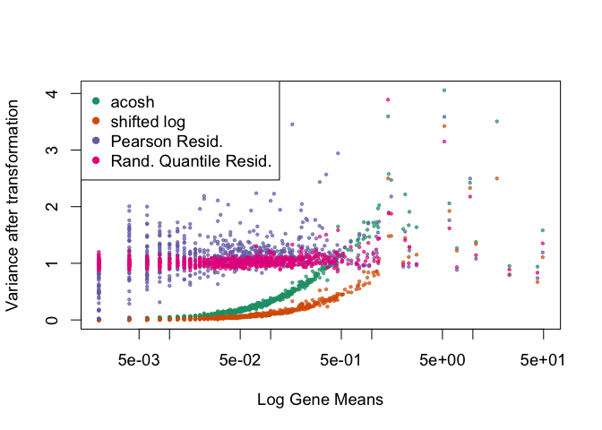

# transformGamPoi

<!-- badges: start -->
<!-- badges: end -->

R package that accompanies our paper ‘Transformation and Preprocessing
of Single-Cell RNA-Seq Data’
(<https://www.biorxiv.org/content/10.1101/2021.06.24.449781v1>).

`transformGamPoi` provides methods to stabilize the variance of single
cell count data:

-   acosh transformation based on the delta method
-   shifted logarithm (log(x + c)) with a pseudo-count c, so that it
    approximates the acosh transformation
-   randomized quantile and Pearson residuals

## Installation

You can install the current development version of `transformGamPoi` by
typing the following into the [*R*](https://cloud.r-project.org/)
console:

``` r
# install.packages("devtools")
devtools::install_github("const-ae/transformGamPoi")
```

The installation should only take a few seconds and work across all
major operating systems (MacOS, Linux, Windows).

## Example

Let’s compare the different variance-stabilizing transformations.

We start by loading the `transformGamPoi` package and setting a seed to
make sure the results are reproducible.

``` r
library(transformGamPoi)
set.seed(1)
```

We then load some example data, which we subset to 1000 genes and 500
cells

``` r
sce <- TENxPBMCData::TENxPBMCData("pbmc4k")
#> snapshotDate(): 2021-05-18
#> see ?TENxPBMCData and browseVignettes('TENxPBMCData') for documentation
#> loading from cache
sce_red <- sce[sample(which(rowSums2(counts(sce)) > 0), 1000),
               sample(ncol(sce), 500)]
```

We calculate the different variance-stabilizing transformations. We can
either use the generic `transformGamPoi()` method and specify the
`transformation`, or we use the low-level functions `acosh_transform()`,
`shifted_log_transform()`, and `residual_transform()` which provide more
settings. All functions return a matrix, which we can for example insert
back into the `SingleCellExperiment` object:

``` r
assay(sce_red, "acosh") <- transformGamPoi(sce_red, transformation = "acosh")
assay(sce_red, "shifted_log") <- shifted_log_transform(sce_red, overdispersion = 0.1)
# For large datasets, we can also do the processing without 
# loading the full dataset into memory (on_disk = TRUE)
assay(sce_red, "rand_quant") <- residual_transform(sce_red, "randomized_quantile", on_disk = FALSE)
assay(sce_red, "pearson") <- residual_transform(sce_red, "pearson", clipping = TRUE, on_disk = FALSE)
```

Finally, we compare the variance of the genes after transformation using
a scatter plot

``` r
par(pch = 20, cex = 1.15)
mus <- rowMeans2(counts(sce_red))
plot(mus, rowVars(assay(sce_red, "acosh")), log = "x", col = "#1b9e77aa", cex = 0.6,
     xlab =  "Log Gene Means", ylab = "Variance after transformation")
points(mus, rowVars(assay(sce_red, "shifted_log")), col = "#d95f02aa", cex = 0.6)
points(mus, rowVars(assay(sce_red, "pearson")), col = "#7570b3aa", cex = 0.6)
points(mus, rowVars(assay(sce_red, "rand_quant")), col = "#e7298aaa", cex = 0.6)
legend("topleft", legend = c("acosh", "shifted log", "Rand. Quantile Resid.", "Pearson Resid."),
       col = c("#1b9e77", "#d95f02", "#7570b3", "#e7298a"), pch = 16)
```

<!-- -->

# See also

There are a number of preprocessing methods and packages out there. Of
particular interests are

-   [sctransform](https://github.com/ChristophH/sctransform) by
    Christoph Hafemeister and the [Satija lab](https://satijalab.org/).
    The original developers of the Pearson residual variance-stabilizing
    transformation approach for single cell data.
-   [scuttle::logNormCounts()](https://bioconductor.org/packages/release/bioc/html/scuttle.html)
    by Aaron Lun. This is an alternative to the
    `shifted_log_transform()` and plays nicely together with the
    Bioconductor universe. For more information, I highly recommend to
    take a look at the
    [normalization](https://bioconductor.org/books/release/OSCA/normalization.html)
    section of the [OSCA
    book](https://bioconductor.org/books/release/OSCA/).
-   [Sanity](https://github.com/jmbreda/Sanity) by Jérémie Breda *et
    al.*. This method is not directly concerned with variance
    stabilization, but still provides an interesting approach for single
    cell data preprocessing.

# Session Info

``` r
sessionInfo()
#> R version 4.1.0 (2021-05-18)
#> Platform: x86_64-apple-darwin17.0 (64-bit)
#> Running under: macOS Mojave 10.14.6
#> 
#> Matrix products: default
#> BLAS:   /Library/Frameworks/R.framework/Versions/4.1/Resources/lib/libRblas.dylib
#> LAPACK: /Library/Frameworks/R.framework/Versions/4.1/Resources/lib/libRlapack.dylib
#> 
#> locale:
#> [1] en_US.UTF-8/en_US.UTF-8/en_US.UTF-8/C/en_US.UTF-8/en_US.UTF-8
#> 
#> attached base packages:
#> [1] parallel  stats4    stats     graphics  grDevices utils     datasets 
#> [8] methods   base     
#> 
#> other attached packages:
#>  [1] TENxPBMCData_1.10.0         HDF5Array_1.20.0           
#>  [3] rhdf5_2.36.0                DelayedArray_0.18.0        
#>  [5] Matrix_1.3-4                SingleCellExperiment_1.14.1
#>  [7] SummarizedExperiment_1.23.4 Biobase_2.52.0             
#>  [9] GenomicRanges_1.44.0        GenomeInfoDb_1.28.0        
#> [11] IRanges_2.26.0              S4Vectors_0.30.0           
#> [13] BiocGenerics_0.38.0         MatrixGenerics_1.5.3       
#> [15] matrixStats_0.60.0          transformGamPoi_0.1.4      
#> 
#> loaded via a namespace (and not attached):
#>  [1] httr_1.4.2                    bit64_4.0.5                  
#>  [3] AnnotationHub_3.0.0           DelayedMatrixStats_1.14.0    
#>  [5] shiny_1.6.0                   assertthat_0.2.1             
#>  [7] interactiveDisplayBase_1.30.0 highr_0.9                    
#>  [9] BiocManager_1.30.16           BiocFileCache_2.0.0          
#> [11] blob_1.2.1                    GenomeInfoDbData_1.2.6       
#> [13] yaml_2.2.1                    BiocVersion_3.13.1           
#> [15] pillar_1.6.1                  RSQLite_2.2.7                
#> [17] lattice_0.20-44               glue_1.4.2                   
#> [19] digest_0.6.27                 promises_1.2.0.1             
#> [21] XVector_0.32.0                htmltools_0.5.1.1            
#> [23] httpuv_1.6.1                  pkgconfig_2.0.3              
#> [25] zlibbioc_1.38.0               purrr_0.3.4                  
#> [27] xtable_1.8-4                  later_1.2.0                  
#> [29] tibble_3.1.2                  KEGGREST_1.32.0              
#> [31] generics_0.1.0                ellipsis_0.3.2               
#> [33] withr_2.4.2                   cachem_1.0.5                 
#> [35] magrittr_2.0.1                crayon_1.4.1                 
#> [37] mime_0.11                     memoise_2.0.0                
#> [39] evaluate_0.14                 fansi_0.5.0                  
#> [41] tools_4.1.0                   lifecycle_1.0.0              
#> [43] stringr_1.4.0                 Rhdf5lib_1.14.1              
#> [45] AnnotationDbi_1.54.1          Biostrings_2.60.1            
#> [47] compiler_4.1.0                rlang_0.4.11                 
#> [49] grid_4.1.0                    RCurl_1.98-1.3               
#> [51] rhdf5filters_1.4.0            rappdirs_0.3.3               
#> [53] glmGamPoi_1.5.3               bitops_1.0-7                 
#> [55] rmarkdown_2.9                 ExperimentHub_2.0.0          
#> [57] DBI_1.1.1                     curl_4.3.2                   
#> [59] R6_2.5.0                      knitr_1.33                   
#> [61] dplyr_1.0.7                   fastmap_1.1.0                
#> [63] bit_4.0.4                     utf8_1.2.1                   
#> [65] filelock_1.0.2                stringi_1.6.2                
#> [67] Rcpp_1.0.6                    vctrs_0.3.8                  
#> [69] png_0.1-7                     sparseMatrixStats_1.4.0      
#> [71] dbplyr_2.1.1                  tidyselect_1.1.1             
#> [73] xfun_0.24
```
